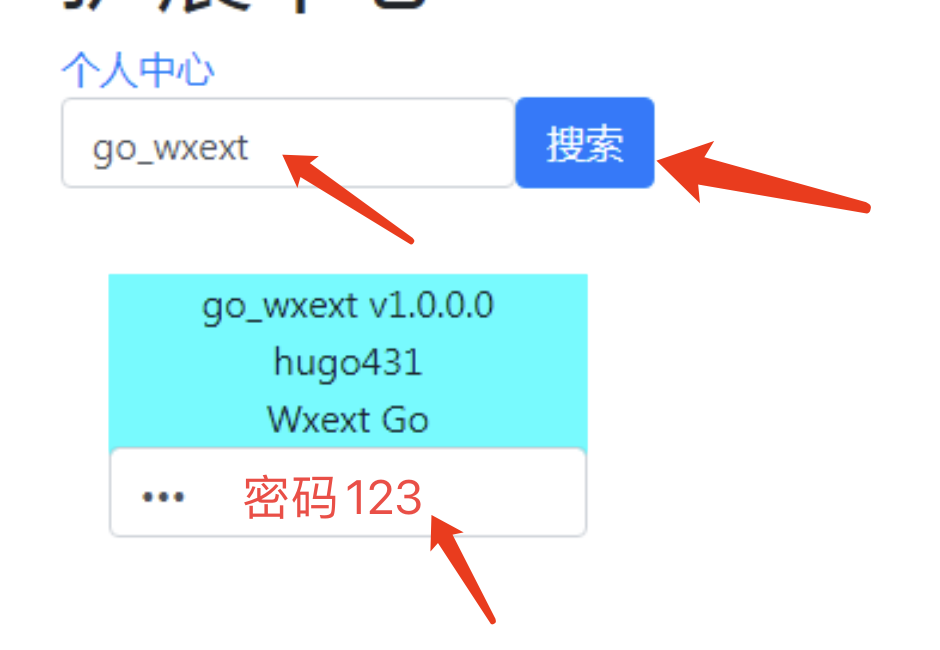
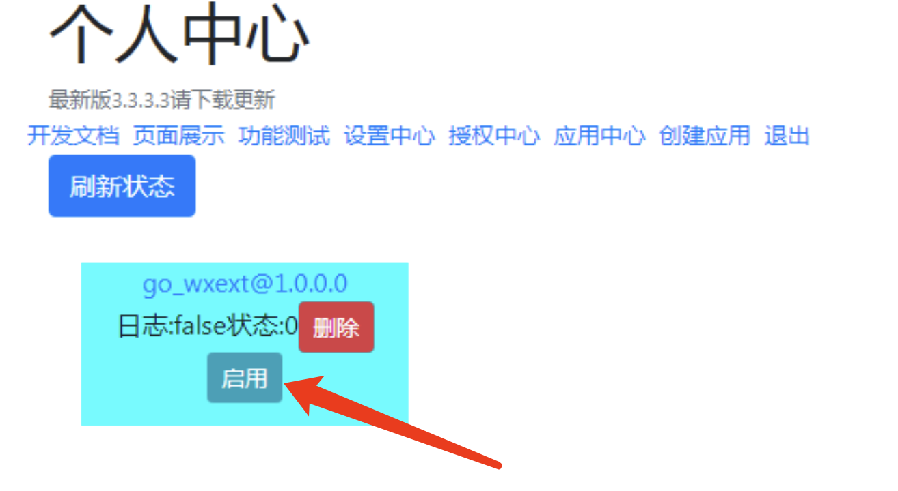

# Wxext Go

## 简介

* 这是基于[Wxext](https://www.wxext.cn/) 开发的Go版SDK
* 你可以在此基础上开发业务

## 使用说明

示例代码请参考[example](https://github.com/asushugo/go-wxext/tree/main/example)

1、把代码放入插件目录下，入口文件为main.go

2、打开应用中心

2、搜索go_wxext，密码是123，然后回车就可以导入了

3、回到个人中心，点击“启用”即可

程序会自动从系统环境变量中获取Name和Key

当然也可以编译成exe，然后在应用中心添加插件go_wxext_bin，然后把exe命名为main.exe，并放入插件目录，在个人中心启用即可！

## 提示

如果出现“连接中断”的问题，基本上就是key不正确

Enjoy it !

