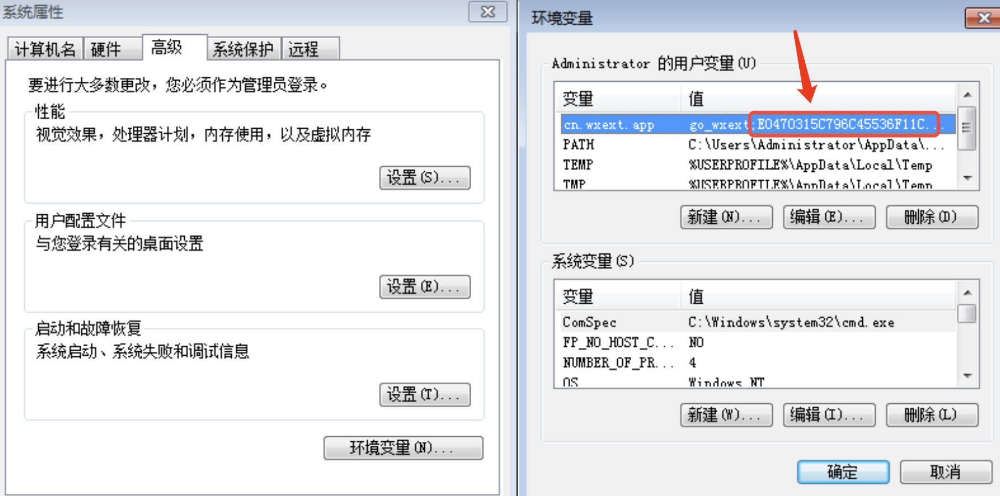
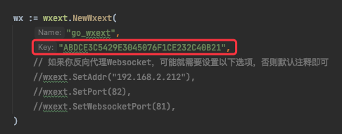

# Wxext Go

## 简介

* 这是基于[Wxext](https://www.wxext.cn/) 开发的Go版SDK
* 你可以在此基础上开发业务

## 使用说明

示例代码请参考[example](https://github.com/asushugo/go-wxext/tree/main/example)

1、打开应用中心

2、搜索go_wxext，密码是123，然后回车就可以导入了

3、回到个人中心，点击“启用”即可

4、在系统环境变量中获取Key

5、最后填入代码中后直接运行代码（go run main.go）即可，也可以生成exe来运行

或者把代码放在插件目录下，入口文件命名为main.go，在个人中心启动应用时也可以运行

## 提示

如果出现“连接中断”的问题，基本上就是你的key不正确

Enjoy it !